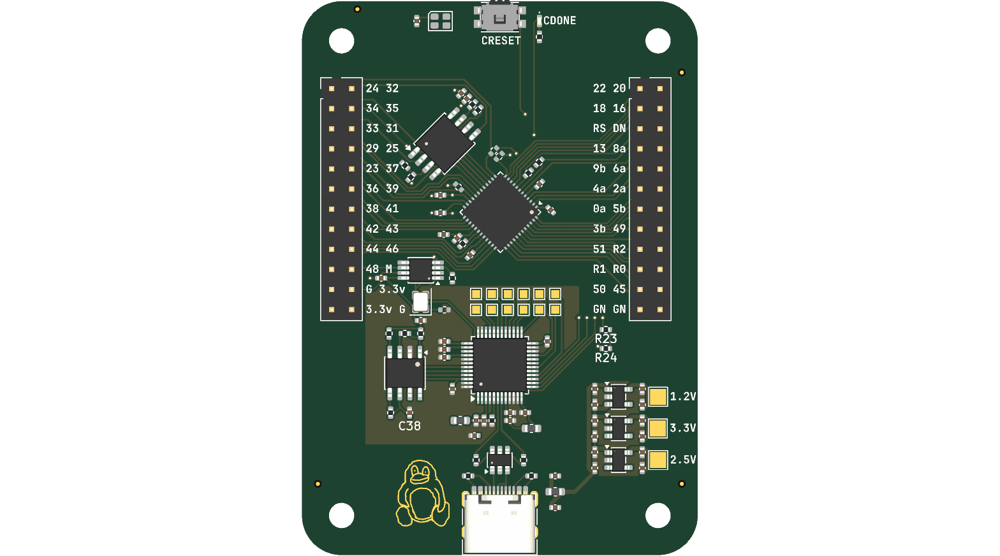

# August 7: project start and component selection

started the fpga board project. the goal i set myself: a small dev board around the lattice ice40 ultraplus, programmed over usb with no external programmer, using the fully open yosys/nextpnr/icestorm flow. i've had enough of vendor toolchains and license servers - if the design tools are half the fun then i want tools i can actually read the source of.

chip choice came down to the ice40up5k-sg48itr. 5280 luts doesn't sound like much next to an artix but it's genuinely plenty for soft cpus and glue logic experiments, the whole chip is a qfn-48 i can realistically hand-solder, and there's one quirk that sold me: the rgb0/1/2 pins are dedicated high-drive outputs meant to sink an rgb led directly. a status light for zero extra parts.

the big decision was programming. most small fpga boards punt on this - jtag header, bring your own dongle. i wanted the board self-contained, so the plan is an ft232h sitting on the spi flash bus that can push bitstreams itself. bonus: it's a general purpose usb bridge the rest of the time, which is handy to have on any bench.

for boot storage, 16mb w25q128jvs flash. absurd overkill for a ~104kb bitstream, but it costs pennies more than the small ones and leaves room for a bootloader plus whatever else i want to ship in there.

set up the kicad project as hierarchical sheets - usb, power, fpga, clock, config, flasher, headers. one giant flat sheet is how you end up with nets named net_1_234 and no idea what they do.

**Total time spent: 3 hours**

# August 7: tinyfpga boot mode

spent the afternoon on the boot/config question before committing any of it to copper, which is why this is a design note sheet (tinyfpga.kicad_sch) and not wiring yet.

the actual question underneath all of this: at power-on, who owns the flash? if a raw bitstream sits in there, the ice40 wakes in spi master mode and slurps it in by itself - that's the default and it always works. but pushing a new bitstream then means reflashing the whole thing every single time, which is slow and wears the flash. the tinyfpga trick is storing a bootloader in the flash instead, so the ft232h can squirt new bitstreams straight over usb.

the wrinkle: the bootloader path needs different series resistors on the data lines than raw spi mode (68r series, 1.5k pull on one line). you can't have both stuffed at once.

solution i settled on: switching between the two is just three 0-ohm straps - r16/r17/r18 on the config sheet - and the bootloader-only resistors are install-options rather than stuffed defaults. so the bare board boots from flash like a normal product, and if i want usb-bootloader convenience later it's five minutes with a soldering iron, not a respin.

**Total time spent: 3 hours**

# August 8: schematic - usb and power

usb sheet first since every other rail hangs off it. usb-c receptacle wired for usb2.0 duty, two 5.1k cc pulldowns so a host recognizes the board as a device instead of ignoring it, usblc6-2sc6 esd clamp right at the connector where the static actually arrives. ferrite bead on vbus and two 10uf bulk caps so cable inductance doesn't drag the input around.

power next. three rails off 5v: 1.2v for the fpga core, 2.5v for vpp during sram configuration, 3.3v for io/flash/ft232h. all from tlv757 ldos - at these currents heat is a non-issue and i'd rather have three dumb linear regulators whose behavior i can predict than one switcher plus filters.

the subtle bit was level translation. the ft232h speaks 3.3v but the ice40's config/spi pins live closer to the core voltage, so a couple of 74auc2g240 dual buffers sit on the clock and config paths keeping the domains honest. cheap insurance against quietly degrading the part i care most about.

**Total time spent: 4 hours**

# August 8: schematic - fpga core

the main event. ice40up5k in qfn-48, exposed pad to ground with vias under it, decoupling against every power pin. vpp_2v5 feeds sram configuration. rgb0/1/2 go to the argb led through series resistors (their whole party trick) plus a plain green status led.

one thing worth writing down because i'll forget: cdone goes high once configuration succeeds, so wiring the green led to cdone means the led is literally a "did the bitstream load" indicator before any user code runs. free debugging.

reset button with 10k pullup, cdone pulled up per datasheet. the w25q128jvs flash sits right next to the fpga's dedicated spi pins (io32-35). i spent an embarrassing amount of time on the flash pin ordering - the ice40 names its master-mode pins spi_si/so/sck/ss and it would be really easy to swap two of them and only find out when iceprog hangs forever. triple-checked against the datasheet tables, then checked again.

the si/so lines also branch toward the config sheet, because in bootloader mode the ft232h needs to own that bus while the fpga stays asleep. two masters, one slave - arbitration by strap resistor.

**Total time spent: 5 hours**

# August 8: schematic - clock, flasher, headers

clock sheet is deliberately boring: a 12mhz sg-210stf oscillator through a 74auc2g240 buffer into the fpga, with a copy sent to the ft232h so the bridge has its own reference too. picked 12mhz because the whole icestorm ecosystem assumes it and it divides down to whatever the design actually needs.

flasher sheet ended up the biggest. ft232h in lqfp-48 with a 93lc56bt eeprom hanging off its mpsse config pins - without the eeprom the chip enumerates with generic descriptors and you're stuck reprogramming it from a host every boot. twelve test points scattered along the spi/control lines because when (not if) bring-up stalls, scope probes need somewhere legal to land. ferrite-filtered power and the usual decoupling crowd.

the ft232h itself was honestly the most annoying part of the entire schematic. 48 pins where most are nc or must be tied somewhere definite - floating inputs on this chip cause real misbehavior, not theoretical ones. went through the datasheet pin by pin, one row of the table at a time, ticking them off.

headers sheet: two 2x24 connectors breaking out the io. the ice40 has all these io pairs (iob_* and iot_* pins) and routing every last one to tidy edge connectors turns the board from "a thing with an fpga on it" into a general breakout i can still be using years from now.

**Total time spent: 6 hours**

# August 8: schematic review

full pass over every sheet, then erc. caught a couple of net-name mismatches between the fpga and config sheets (same physical signal, two different labels - classic hierarchical sheet disease) plus a dangling label on the flasher. fixed, erc clean.

also noticed the r16/r17/r18 strap designators exist twice: once on the config sheet, once on the tinyfpga note sheet. that's intentional (same physical resistors, the note sheet documents the alternate population) but reading it cold is confusing. left a mental note to rename the note-sheet copies if this ever gets a second reader.

**Total time spent: 2 hours**

# August 8: pcb start

imported the netlist and set up the board: 4-layer, 50x70mm, rounded corners. went back and forth on layer count first - two would be cheaper, but then every return path fights over one ground plane, and this board has an fpga, an ft232h, and three rails sharing tight space. four layers buy quiet reference planes and actual routing channels for a few dollars more.

placement first. usb-c on one edge, header bank opposite so the board can straddle a breadboard or dock edge-to-edge. fpga center with the flash immediately adjacent (those four spi lines want to be millimeters long, not centimeters). ft232h exiled to its own corner away from the fpga so its activity doesn't sit on top of the config lines.

started fanout. the thing i'm watching from here on: keeping spi short and the 1.2v core rail quiet.

**Total time spent: 3 hours**

# August 8: firmware - rainbow proof of life

wrote the first bitstream before finishing the layout, on purpose - i wanted proof the pin mapping in my head matched the pin mapping in the schematic before the board goes to fab and freezes it. pulled the exact netlist out with kicad-cli instead of trusting library symbols, which immediately earned its keep: turns out the green led (d2) hangs off cdone as a config indicator (not a user gpio), and the 12mhz clock lands on iob_25b_g3, package pin 20. either assumption wrong = bricked-looking board.

the demo itself is a rainbow: a 12mhz clock divider steps an 8-bit hue 25 times a second, a tiny 6-segment hsv->rgb block converts hue to rgb, and the rgb0/1/2 open-drain pins (39/40/41) drive the common-anode led active-low. full lap every 10 seconds. doing the color conversion in fabric means the animation costs the cpu exactly nothing - there isn't even a cpu.

set up the icestorm flow under firmware/: yosys -> nextpnr-ice40 -> icepack -> iceprog behind a makefile. yosys synthed clean, timing closes at 12mhz easily (design is good to ~62mhz, so headroom everywhere), and the rgb pins landed exactly where the pcf file claimed they would. bitstream is 104kb, fits the w25q128 with room for a bootloader later.

**Total time spent: 2 hours**

# August 8: production files and fab order

prepared manufacturing outputs: committed the fabrication-toolkit dump - gerbers, drill, positions, ipc netlist, bom, designators - under kicad/production/. promoted bom.csv to repo root as the canonical bill and added cost columns plus pcb/stencil line items so the whole order lives in one place.

placed the order: purple mask, 1.6mm, lead-free hasl, 100x150mm panel no framework. board is 50x70 with rounded corners. stencil top-side only - through-hole is just headers and the usb-c shell, everything the stencil exists for (0402s, the qfn-48) is on top. $20 for boards, $18 stencil.

**Total time spent: 1 hour**

# August 8: schematic review - external feedback

sent schematics out for review and got back a solid list from the forge keeper. the good kind of feedback - specific, actionable, none of it vague vibes:

- r3/r4 (usb data line resistors): originally 5.1k, reviewer said remove entirely since the ft232h drives the lines directly. i compromised at 22r instead - keeps some current limiting without fighting the driver. defensible either way, and it's my board.
- missing 100nf caps on usblc6 vbus (c37) and 93lc56bt vcc (c38): added both. the eeprom especially wanted local decoupling. plain oversight on my part.
- pullups on flash cs and sclk (r23/r24): 10k pulls to vcc_io so the w25q128 never sees garbage commands while the fpga powers up. this one stung because i'd been staring at that exact corner - floating cs on a spi flash during power ramp is how you get spurious writes and a mysteriously corrupted boot image months later. good catch.
- power sequencing delay between vcc (1.2v core) and vcc_io (3.3v): flagged as absent. the tlv757s rise fast enough that practice should be fine, but it's a real consideration and noted for a production revision.

none of it breaks the board. it's exactly the gap between "dev board" and "product board", and now i know where the seams are. rc sequencing folds into rev b if this ever earns one.

also updated the bom for moq reality: the flash alone has moq 12 on lcsc (buy a reel, use one), same story for resistors at moq 100. component cost lands around $65.65 per board at moq-adjusted pricing, $103.65 once pcb and stencil join in.

**Total time spent: 3 hours**

# August 25: through-hole vias out of pads

the fpga (qfn-48) has a huge exposed pad - center pad plus the ground pins under the package.

 routing ground up from those pins used to mean vias right in the pads, which is a manufacturing headache: via-in-pad needs plating and filling, and even then it's the first thing that lifts during reflow. on a 4-layer board it was forcing me to tunnel everything through the fanout directly under the die.

swapped the footprint for one with a smaller exposed pad so there's actually room to route traces between the pad and the package pins. still the same ice40up5k, same qfn-48, but now vias land on the ring around the ep instead of buried in the pad itself. ground stitching comes up through the peripheral pad ring where it's clean, and the core gets its connection through the smaller ep straight to the plane.

it's one of those layout changes that doesn't show in the schematic at all - same net, same component - but makes the difference between a board that's mostly a ground-return mess and one that actually routes. via-in-pad is a fine technique when you have a multilayer budget and it's the only option; on a 4-layer hobby board it's probably unnecessary.

**Total time spent: 2 hours**

