# August 7: project start and component selection

started the fpga board project. wanted a small dev board around the lattice ice40 ultraplus - it packs a real amount of logic into a tiny qfn-48 and the open-source yosys/nextpnr/icestorm flow means i dont have to fight a vendor toolchain. also wanted it self-contained so i can program it over usb without dragging a programmer around.

picked the ice40up5k-sg48itr specifically. 5280 luts, 1.2v core, and the rgb0-2 pins can sink enough current to drive an rgb led directly, which is a neat trick for a tiny board.

the big decision was programming. most tiny fpga boards either use an external programmer or a jtag header. i wanted it all on board, so an ft232h over spi it is - it doubles as a general usb bridge if i ever need one. 16mb w25q128jvs flash for the boot bitstream.

set up the kicad project as hierarchical sheets so each block stays manageable - usb, power, fpga, clock, config, flasher, headers.
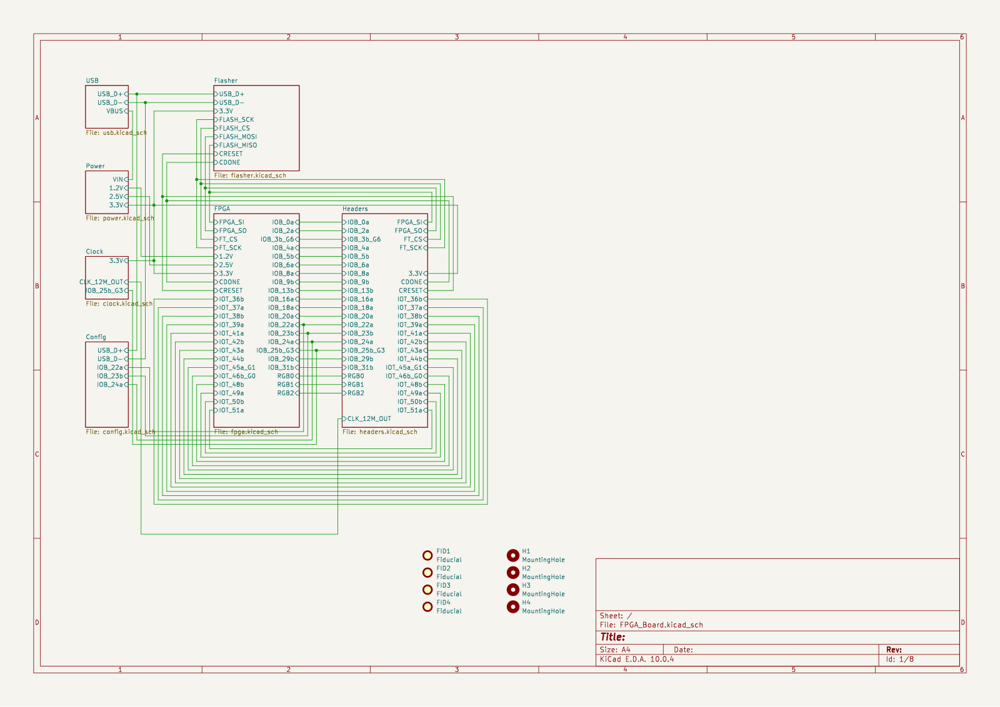

**Total time spent: 3 hours**

# August 7: tinyfpga boot mode

spent the afternoon on the boot/config question. wrote out a tinyfpga bx compatible mode as a separate design note sheet (tinyfpga.kicad_sch) so i could think through it before committing to the strap resistors.

the idea: the flash can hold either a raw bitstream (spi master mode, the default) or the tinyfpga bootloader, which lets the ft232h push bitstreams straight over usb without reflashing the flash every time. switching between them is just a few 0-ohm straps - r16/r17/r18 on the config sheet.

for the bootloader path the serial resistors need to change (68r on the data lines, 1.5k pull on one of them), so i left those as install-options rather than stuffing them by default. it means the board can do both without a board respin.
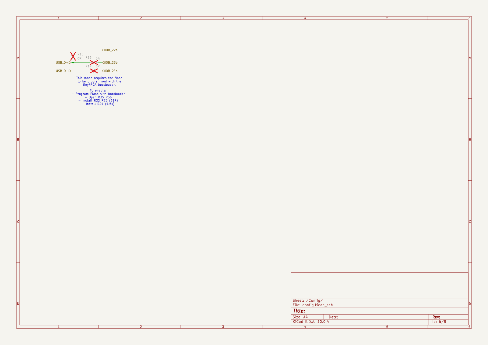

**Total time spent: 3 hours**

# August 8: schematic - usb and power

did the usb sheet first. usb-c receptacle for usb2.0, two 5.1k cc pulldowns so it presents as a device. usblc6-2sc6 esd clamp on the data lines, ferrite bead on vbus. two 10uf bulk caps at the connector.

power sheet next. three tlv757 ldos off the 5v rail - 1.2v for the fpga core, 2.5v for the vpp/io banks, 3.3v for the io, flash, and ft232h. decoupling on every rail. added a couple of 74auc2g240 dual buffers to translate between the 3.3v and 1.2v domains on the clock and config paths - the ice40's spi pins can run at a lower voltage and the ucsi buffer keeps the levels clean.
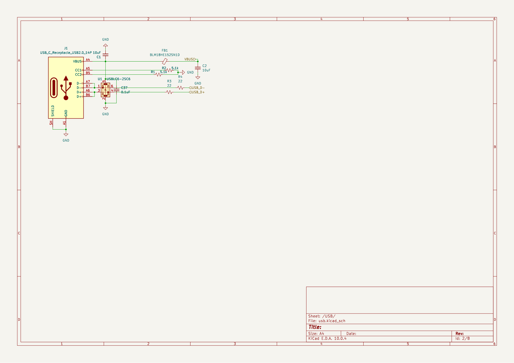
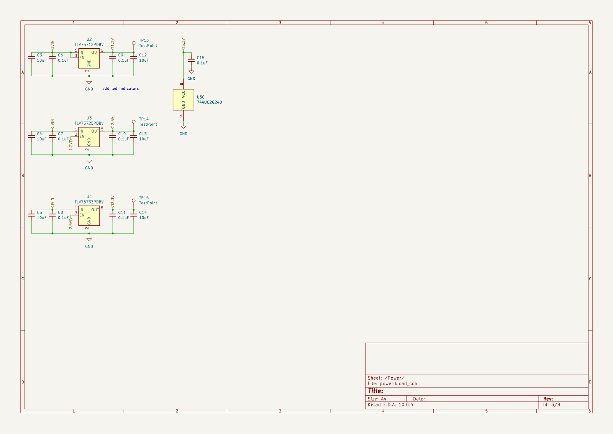

**Total time spent: 4 hours**

# August 8: schematic - fpga core

the fpga sheet. ice40up5k in qfn-48 with the exposed pad on ground, decoupling caps against every power pin. vpp_2v5 for the sram configuration. wired the rgb0/1/2 open-drain pins to the argb led through series resistors, plus a plain green status led.

reset button with a 10k pullup, cdone pulled up. the w25q128jvs spi flash sits right next to the fpga's dedicated spi pins (io32-35). spent a while on the flash pin ordering - the ice40 has specific pins for spi_si/so/sck/ss in master mode and it was easy to swap two of them if i wasnt careful.

the si/so lines to the flash also branch off toward the config sheet so the ft232h can either own the flash (bootloader mode) or stay out of the way.
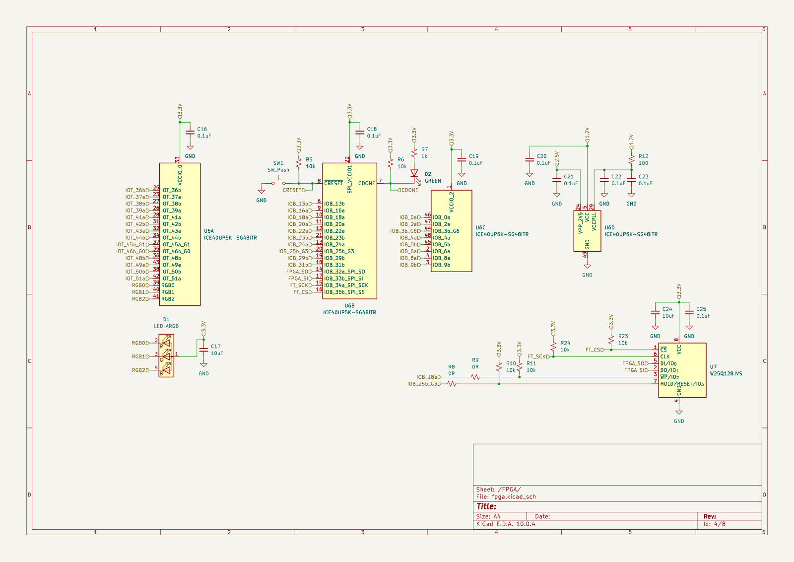

**Total time spent: 5 hours**

# August 8: schematic - clock, flasher, headers

clock sheet is simple - a 12mhz sg-210stf oscillator through a 74auc2g240 buffer to the fpga, plus a copy of the clock to the ft232h so the bridge is clocked too.
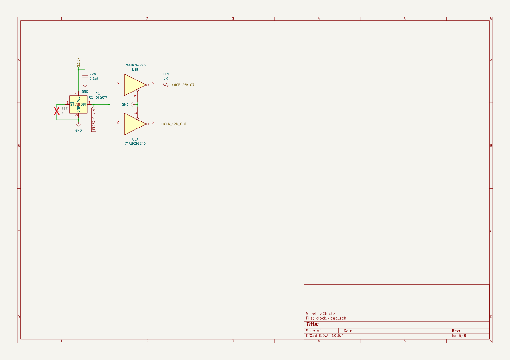

flasher sheet is the biggest. ft232h in lqfp-48 with a 93lc56bt eeprom on its mpsse config pins, 12 test points scattered along the spi and control lines, ferrite-filtered power, and the usual decoupling mess. the ft232h was actually pretty involved - 48 pins, most of them nc or needing to be tied to a known state. went through the datasheet pin by pin so nothing floats.
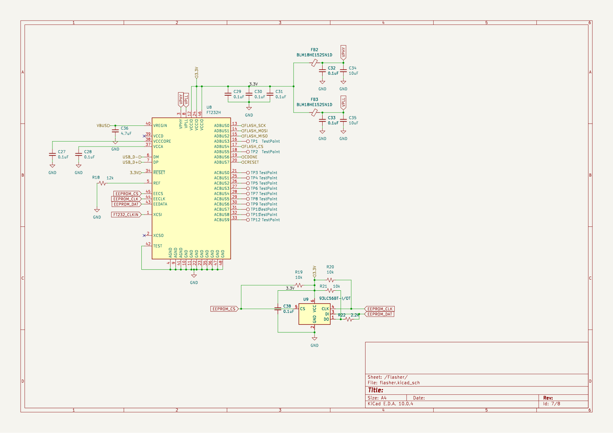

headers sheet - two 2x24 pin header breaking out the io pins. the ice40 has a bunch of io pairs (iob_* and iot_* pins) and routing them all to two tidy connectors keeps the board useful as a general fpga breakout.
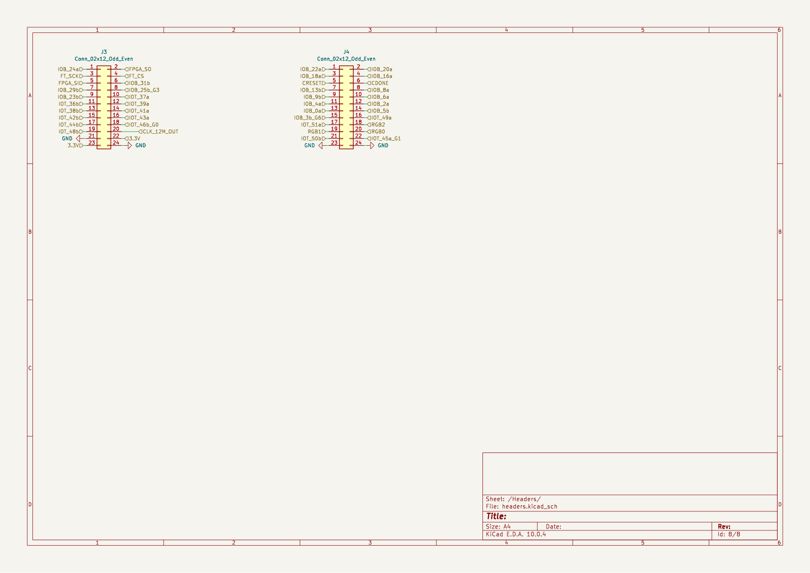

**Total time spent: 6 hours**

# August 8: schematic review

full review of all sheets, ran erc. caught a couple of net-name mismatches between the fpga and config sheets (the same signal with two names) and a dangling label on the flasher. fixed them, erc is clean now.

the r16/r17/r18 strap designators also show up on the tinyfpga note sheet which is confusing when reading the schematic - theyre the same physical resistors so its intentional, but i might rename the note sheet's copies later to make it less confusing.

**Total time spent: 2 hours**

# August 8: pcb start

imported the netlist and set up the board. 2-layer, 50x70mm with rounded corners - plenty of room for a qfn-48 fpga and a header on the edge. drew the edge cuts with the corner arcs so it feels like a proper product board and not a rectangle.

placed the big stuff - usb-c on one edge, header on the opposite so it can sit on a breadboard or dock edge-to-edge. fpga in the middle with the flash right beside it, ft232h on its own side away from the fpga. started the fanout.

still routing, but the placement feels good so far. the trick will be keeping the spi lines short and the 1.2v rail clean.
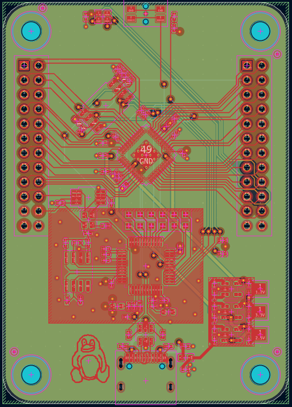

**Total time spent: 3 hours**

# August 8: firmware - rainbow proof of life

wrote the first bitstream for the board. pulled the exact netlist out of the schematic with kicad-cli to get the pin map straight instead of guessing from the library symbols - that caught the fact that the green led (d2) is wired to cdone as a config indicator, not a user gpio, and that the 12mhz clock lands on iob_25b_g3 (package pin 20).

the firmware is a rainbow demo: a 12mhz clock divider steps an 8-bit hue 25 times a second, a tiny 6-segment hsv->rgb block turns the hue into rgb, and the rgb0/1/2 open-drain pins (pins 39/40/41) drive the common-anode led active-low. one full lap every 10 seconds.

set up the icestorm flow in firmware/ - yosys -> nextpnr-ice40 -> icepack -> iceprog behind a makefile. yosys synths clean, timing passes at 12mhz (the design is good for ~62mhz, so lots of headroom), and the rgb pins land exactly where the pcf says they should. bitstream is 104kb, fits the w25q128 with room for a bootloader later.
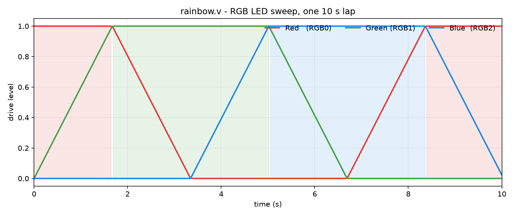

**Total time spent: 2 hours**

# August 8: production files and fab order

prepared for manufacturing. committed the fabrication-toolkit outputs - gerbers, drill, positions, ipc netlist, plus the bom and designators - under kicad/production/. promoted bom.csv to the repo root as the main bom file and added a cost column plus the pcb and stencil line items so the whole order lives in one place.

placed the order: purple solder mask, 1.6mm board, lead-free hasl, 100x150mm panel with no framework. the board itself is 50x70mm with rounded corners so it fits the tier comfortably. stencil for the top side only - the only through-hole parts are the headers and the usb-c, everything else is smd and the stencil is for the 0402s and the qfn-48. pcb is $20, stencil is $18.
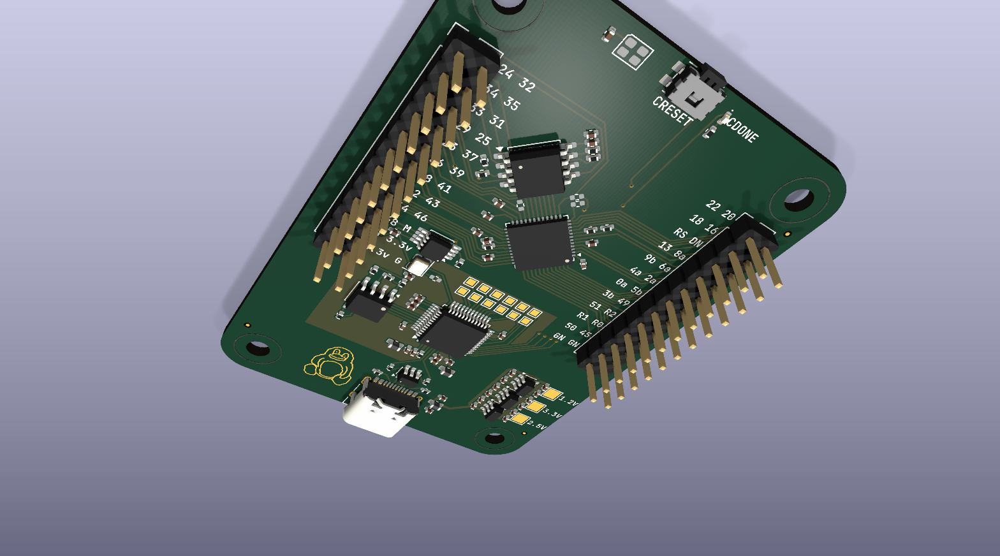

**Total time spent: 1 hour**

# August 8: schematic review - external feedback

sent the schematics out for review and got back a solid list from the forge keeper. most of the feedback was targeted and actionable:

- r3/r4 (usb data line resistors): originally 5.1k, reviewer said they should be removed entirely since the ft232h drives the lines directly. changed them to 22r instead of removing - keeps some current limiting without fighting the driver. a compromise.
- 100nf caps missing on usblc6 vbus (c37) and 93lc56bt vcc (c38): added both. the eeprom especially would benefit from the local decoupling, and it was just an oversight.
- pullups on flash cs and sclk lines (r23/r24): added 10k pulls to vcc_io so the w25q128 doesn't see glitched commands during fpga power-up. good catch - floating cs on a spi flash is a recipe for spurious writes.
- delay on fpga power sequencing: reviewer flagged the lack of sequencing between vcc (1.2v core) and vcc_io (3.3v). the tlv757s have fast rise times so in practice it should be fine, but noted as optional improvement for production.

none of these are board-breaking - theyre the kind of stuff that separates a dev board from a product board. will fold the rc sequencing into the next revision if this goes to production.

also updated the bom to include moq-aware pricing. turns out the flash chip (w25q128jvs) has an moq of 12 on lcsc, so even though the board only needs one, you have to buy a reel of 12. same story for the 5.1k and 10k resistors at moq 100. the total component cost per board comes to about $65.65 at moq-adjusted pricing, or $103.65 with the pcb and stencil.

**Total time spent: 3 hours**