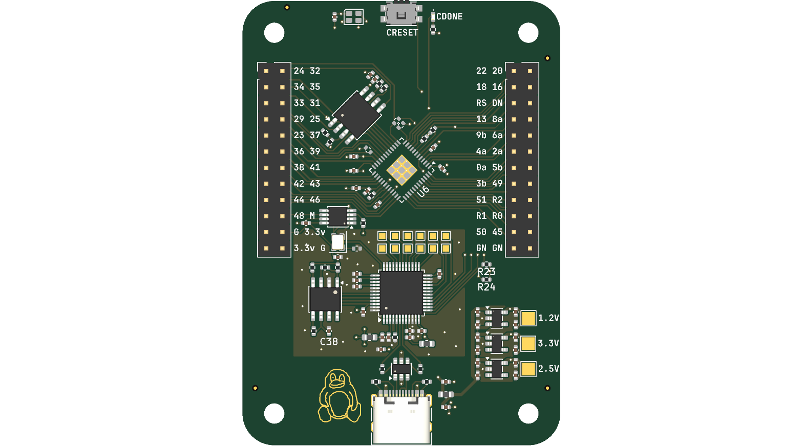

# FPGA_Board

A iCE40 FPGA devboard

## Custom Features
- ICE40UP5K-SG48ITR FPGA (5280 LUTs, QFN-48)
- On-board FT232H flasher with EEPROM
- 16MB W25Q128JVS SPI flash
- USB-C with ESD protection
- RGB LED, green config-status LED, reset button
- 12MHz oscillator, 4-layer PCB

## PCB Design

The board is a 4-layer PCB.

It is built around the Lattice iCE40 FPGA, designed to be programmed over USB through the on-board FT232H. The SPI flash boots the bitstream on power-up.
It is fully supported by the open-source yosys/nextpnr/icestorm flow.

## Firmware

As the board uses an iCE40 UltraPlus, it is programmed with yosys + nextpnr-ice40 + icepack + iceprog/icestorm.

## BOM

| Ref | Value | LCSC # | MPN | Manufacturer | Footprint | Qty | Unit $ | Ext $ | Link |
|-----|-------|--------|-----|--------------|-----------|-----|--------|-------|------|
| C1,C2,C3,C4,C5,C12,C13,C14,C17,C24,C34,C35 | 10uF 0402 | C307415 | - | - | 0402 | 12 | 0.1900 | 2.28 | [LCSC](https://www.lcsc.com/product-detail/C307415.html) |
| C6,C7,C8,C9,C10,C11,C15,C16,C18,C19,C20,C21,C22,C23,C25,C26,C27,C28,C29,C30,C31,C32,C33,C37,C38 | 100nF 0402 | C131394 | - | - | 0402 | 25 | 0.0096 | 0.24 | [LCSC](https://www.lcsc.com/product-detail/C131394.html) |
| C36 | 4.7uF 0402 | C21120 | - | - | 0402 | 1 | 0.0200 | 0.02 | [LCSC](https://www.lcsc.com/product-detail/C21120.html) |
| D1 | LED_ARGB PLCC4 | C2786 | - | - | LED_Cree-PLCC4_2x2mm_CW | 1 | 0.1300 | 0.13 | [LCSC](https://www.lcsc.com/product-detail/C2786.html) |
| D2 | Green LED 0402 | C2286 | - | - | 0402 | 1 | 0.0100 | 0.01 | [LCSC](https://www.lcsc.com/product-detail/C2286.html) |
| FB1,FB2,FB3 | Ferrite Bead 1.5k | C82155 | BLM18HE152SN1D | muRata | 0603 | 3 | 0.0300 | 0.09 | [LCSC](https://www.lcsc.com/product-detail/C82155.html) |
| J1 | USB-C Receptacle 14P | C165948 | TYPE-C-31-M-12 | Korean Hroparts Elec | USB-C | 1 | 0.1900 | 0.19 | [LCSC](https://www.lcsc.com/product-detail/C165948.html) |
| J3,J4 | Pin Header 2x12 2.54mm | C492423 | PZ254V-12-12P | XFCN | Through Hole | 2 | 0.0700 | 0.14 | [LCSC](https://www.lcsc.com/product-detail/C492423.html) |
| R1,R2 | 5.1k 1% 0402 | C25905 | 0402WGF5101TCE | UNI-ROYAL | 0402 | 2 | 0.0040 | 0.01 | [LCSC](https://www.lcsc.com/product-detail/C25905.html) |
| R3,R4 | 22R 1% 0402 | C23200 | - | - | 0402 | 2 | 0.0040 | 0.01 | [LCSC](https://www.lcsc.com/product-detail/C23200.html) |
| R5,R6,R10,R11,R19,R20,R21,R23,R24 | 10k 1% 0402 | C25904 | - | - | 0402 | 9 | 0.0040 | 0.04 | [LCSC](https://www.lcsc.com/product-detail/C25904.html) |
| R7 | 1k 1% 0402 | C25898 | - | - | 0402 | 1 | 0.0040 | 0.00 | [LCSC](https://www.lcsc.com/product-detail/C25898.html) |
| R8,R9,R14 | 0R 0402 | C25887 | - | - | 0402 | 3 | 0.0030 | 0.01 | [LCSC](https://www.lcsc.com/product-detail/C25887.html) |
| R12 | 100R 1% 0402 | C22861 | - | - | 0402 | 1 | 0.0040 | 0.00 | [LCSC](https://www.lcsc.com/product-detail/C22861.html) |
| R18 | 12k 1% 0402 | C25913 | - | - | 0402 | 1 | 0.0040 | 0.00 | [LCSC](https://www.lcsc.com/product-detail/C25913.html) |
| R22 | 2.2k 1% 0402 | C25901 | - | - | 0402 | 1 | 0.0040 | 0.00 | [LCSC](https://www.lcsc.com/product-detail/C25901.html) |
| SW1 | Tactile Switch EVQPUD | C158289 | EVQPUM | PANASONIC | SMD | 1 | 0.2000 | 0.20 | [LCSC](https://www.lcsc.com/product-detail/C158289.html) |
| U1 | USBLC6-2SC6 | C7519 | USBLC6-2SC6 | ST | SOT-23-6 | 1 | 0.1800 | 0.18 | [LCSC](https://www.lcsc.com/product-detail/C7519.html) |
| U2 | TLV75712PDBV | C485515 | TLV75712PDBVR | TI | SOT-23-5 | 1 | 0.1800 | 0.18 | [LCSC](https://www.lcsc.com/product-detail/C485515.html) |
| U3 | TLV75725PDBV | C485516 | TLV75725PDBVR | TI | SOT-23-5 | 1 | 0.1800 | 0.18 | [LCSC](https://www.lcsc.com/product-detail/C485516.html) |
| U4 | TLV75733PDBV | C485517 | TLV75733PDBVR | TI | SOT-23-5 | 1 | 0.1800 | 0.18 | [LCSC](https://www.lcsc.com/product-detail/C485517.html) |
| U5 | 74AUC2G240 | C2652105 | - | - | VSSOP-8 | 1 | 0.7200 | 0.72 | [LCSC](https://www.lcsc.com/product-detail/C2652105.html) |
| U6 | ICE40UP5K-SG48ITR | C2678152 | ICE40UP5K-SG48ITR | Lattice | QFN-48 | 1 | 8.5600 | 8.56 | [LCSC](https://www.lcsc.com/product-detail/C2678152.html) |
| U7 | W25Q128JVS | C113767 | W25Q128JVS | Winbond | SOIC-8 | 1 | 2.5200 | 2.52 | [LCSC](https://www.lcsc.com/product-detail/C113767.html) |
| U8 | FT232H | C51997 | FT232HL | FTDI | LQFP-48 | 1 | 10.6200 | 10.62 | [LCSC](https://www.lcsc.com/product-detail/C51997.html) |
| U9 | 93LC56BT-I/OT | C190271 | 93LC56BT-I/OT | Microchip | SOIC-8 | 1 | 0.4500 | 0.45 | [LCSC](https://www.lcsc.com/product-detail/C190271.html) |
| Y1 | SG-210STF 12MHz | C17426037 | SG-210STF | Seiko Epson | 2.5x2.0mm | 1 | 0.3700 | 0.37 | [LCSC](https://www.lcsc.com/product-detail/C17426037.html) |
| PCB | Bare PCB | — | — | — | 50x70mm | 1 | 20.0000 | 20.00 | — |
| STENCIL | Top stencil | — | — | — | 100x150mm | 1 | 18.0000 | 18.00 | — |
| **Total** | — | — | — | — | — | **79** | — | **65.33** | — |

Full CSVs: [LCSC BOM](BOM.csv)
[KiCad generated BOM](kicad/production/bom.csv)
[Pick and place](kicad/production/positions.csv)

## Production

This board assumes JLCPCB's standard 4 layer
- HASL Lead Free
- 1.6mm thick board